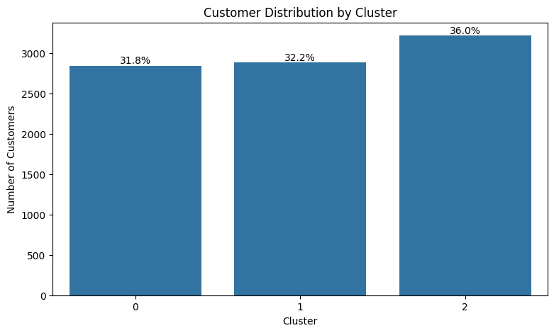
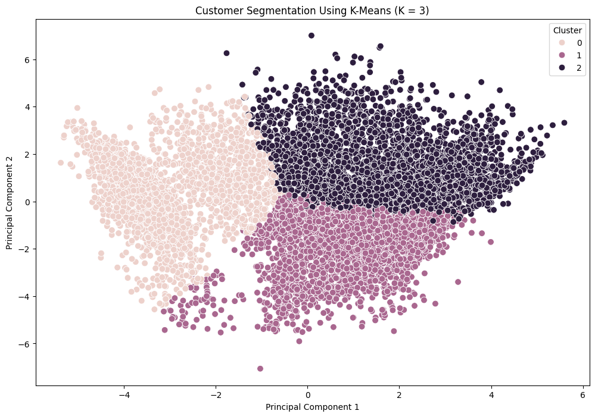

#  Bank Customer Segmentation

> An end-to-end unsupervised machine learning project that uses K-Means clustering to identify meaningful customer segments based on credit-card usage and financial behaviour.

---

##  Project Overview

Customer segmentation helps financial institutions understand groups of customers with similar behavioural patterns.

This project analyzes credit-card customer data and applies **K-Means Clustering** to identify distinct customer segments based on financial activity, spending patterns, credit utilization and payment behaviour.

The goal is to transform customer behavioural data into **actionable business insights** that can support targeted marketing, customer engagement and financial product strategies.

---

##  Project Objective

The primary objectives of this project are to:

- Identify distinct customer behaviour patterns
- Segment customers using unsupervised machine learning
- Determine the optimal number of customer segments
- Profile each customer segment
- Visualize customer groups
- Translate clustering results into actionable business recommendations

---

##  Technologies Used

| Category | Technologies |
|---|---|
| **Programming** | Python |
| **Data Analysis** | Pandas, NumPy |
| **Visualization** | Matplotlib, Seaborn |
| **Machine Learning** | Scikit-learn |
| **Clustering** | K-Means |
| **Dimensionality Reduction** | PCA |
| **Cluster Evaluation** | Silhouette Analysis, Elbow Method |
| **Environment** | Google Colab / Jupyter Notebook |

---

##  Project Workflow

```text
Dataset
   ↓
Data Cleaning
   ↓
Exploratory Data Analysis
   ↓
Missing Value Treatment
   ↓
Log Transformation
   ↓
Feature Scaling
   ↓
Elbow Method
   ↓
Silhouette Analysis
   ↓
K-Means Clustering
   ↓
Customer Profiling
   ↓
PCA Visualization
   ↓
Business Recommendations
```

---

##  Dataset

The dataset contains approximately **8,950 credit-card customer records** and **18 variables** describing customer financial and behavioural patterns.

### Dataset Features

| Variable | Description |
|---|---|
| `CUST_ID` | Identification of the credit-card holder |
| `BALANCE` | Balance amount available in the customer's account |
| `BALANCE_FREQUENCY` | Frequency with which the customer's balance is updated |
| `PURCHASES` | Total amount of purchases made through the account |
| `ONEOFF_PURCHASES` | Maximum purchase amount made in a single transaction |
| `INSTALLMENTS_PURCHASES` | Total amount of purchases made through installments |
| `CASH_ADVANCE` | Amount of cash advance taken by the customer |
| `PURCHASES_FREQUENCY` | Frequency of purchases made by the customer |
| `ONEOFF_PURCHASES_FREQUENCY` | Frequency of one-off purchases |
| `PURCHASES_INSTALLMENTS_FREQUENCY` | Frequency of installment purchases |
| `CASH_ADVANCE_FREQUENCY` | Frequency of cash-advance transactions |
| `CASH_ADVANCE_TRX` | Number of cash-advance transactions |
| `PURCHASES_TRX` | Number of purchase transactions |
| `CREDIT_LIMIT` | Credit limit assigned to the customer |
| `PAYMENTS` | Total amount of payments made by the customer |
| `MINIMUM_PAYMENTS` | Minimum payment amount made by the customer |
| `PRC_FULL_PAYMENT` | Percentage of payments made in full |
| `TENURE` | Duration of the customer's relationship with the credit-card service |

---

##  Data Preprocessing

The following preprocessing steps were performed before clustering.

### 1. Duplicate Removal

Duplicate customer records were identified and removed to improve data quality.

### 2. Missing Value Treatment

Missing values in:

- `MINIMUM_PAYMENTS`
- `CREDIT_LIMIT`

were handled using **median imputation**.

### 3. Customer ID Removal

`CUST_ID` was removed because it is an identifier and does not provide meaningful behavioural information for clustering.

### 4. Log Transformation

Financial variables showed significant right-skewness.

A `log1p()` transformation was applied to reduce the influence of extreme values while preserving zero-valued observations.

### 5. Feature Scaling

`StandardScaler` was applied so that features with different numerical ranges would contribute fairly to K-Means distance calculations.

---

##  Exploratory Data Analysis

Exploratory Data Analysis was performed to understand customer behaviour and identify patterns across important financial variables.

The analysis focused on:

- Balance
- Purchases
- Credit Limit
- Cash Advance
- Payments
- Full-Payment Behaviour

### Feature Distributions


### Correlation Matrix


---

##  Selecting the Number of Clusters

Two evaluation techniques were used to determine the appropriate number of clusters.

### 1. Elbow Method

The Elbow Method was used to evaluate the **Within-Cluster Sum of Squares (WCSS)** across different values of K.


### 2. Silhouette Analysis

Silhouette Scores were calculated for different values of K from **2 to 10**.

The evaluated scores were:

| K | Silhouette Score |
|---:|---:|
| 2 | 0.2100 |
| 3 | **0.2510** |
| 4 | 0.1977 |
| 5 | 0.1931 |
| 6 | 0.2029 |
| 7 | 0.2077 |
| 8 | 0.2217 |
| 9 | 0.2260 |
| 10 | 0.2204 |

###  Selected Model

**K = 3**

**Best Silhouette Score = 0.2510**


Based on the evaluation, **3 clusters** were selected for the final K-Means model.

---

##  K-Means Clustering

The final clustering model was trained using:

| Parameter | Value |
|---|---|
| **Algorithm** | K-Means |
| **Number of Clusters** | 3 |
| **Random State** | 42 |
| **Initializations** | 10 |

Each customer was assigned to one of the three identified behavioural segments.

---

##  Customer Segments

### 🟢 Cluster 0 — High-Value Active Customers

#### Characteristics

- High purchase activity
- High payment activity
- Relatively high credit limit
- Relatively low cash-advance usage
- Higher full-payment behaviour

####  Business Recommendations

- Premium credit-card offerings
- Exclusive rewards
- Cashback programs
- Personalized offers
- Loyalty programs
- Cross-selling relevant financial products

---

###  Cluster 1 — Low-Engagement Customers

#### Characteristics

- Lower purchase activity
- Lower payment activity
- Lower balance
- Lower credit limit compared with other segments

####  Business Recommendations

- Cashback campaigns
- Personalized promotions
- Loyalty incentives
- Card-usage campaigns
- Customer engagement programs

---

###  Cluster 2 — Cash-Advance Heavy Customers

#### Characteristics

- High balance
- Very high cash-advance usage
- Relatively low purchase activity
- Very low full-payment ratio

####  Business Recommendations

- Monitor cash-advance behaviour
- Encourage healthier repayment behaviour
- Offer appropriate financial-management products
- Provide personalized financial guidance
- Consider additional behavioural monitoring

> **Note:** The clustering model identifies behavioural patterns. It does not prove that customers are in default or definitively high-risk.

---

##  Customer Segment Distribution

The following visualization shows how customers are distributed across the three identified segments.



---

##  Cluster Profile

The average behaviour of each cluster was analyzed using:

- Balance
- Purchases
- Credit Limit
- Cash Advance
- Payments
- Percentage of Full Payment

| Cluster | Balance | Purchases | Credit Limit | Cash Advance | Payments | Full Payment |
|---|---:|---:|---:|---:|---:|---:|
| **0** | 2,182.35 | 4,187.02 | 7,642.78 | 449.75 | 4,075.53 | 30% |
| **1** | 807.72 | 496.06 | 3,267.02 | 339.00 | 907.45 | 15% |
| **2** | 4,023.79 | 389.05 | 6,729.47 | 3,917.25 | 3,053.94 | 3% |


---

##  PCA Visualization

**Principal Component Analysis (PCA)** was used to reduce the dimensionality of the feature space to two principal components for visualization.



The PCA visualization provides a two-dimensional representation of the identified customer groups.

---

##  Key Business Insights

### 🟢 High-Value Active Customers

This segment demonstrates strong purchase and payment activity and can be targeted with premium services, loyalty benefits and personalized offers.

### 🔵 Low-Engagement Customers

This group shows relatively low activity and can be targeted with campaigns designed to increase card usage and engagement.

### 🔴 Cash-Advance Heavy Customers

This group demonstrates high cash-advance usage combined with low full-payment behaviour. These behavioural patterns can be monitored and addressed through appropriate financial products and engagement strategies.

---

##  Business Applications

The segmentation framework can support:

- Customer profiling
- Personalized marketing
- Customer retention
- Loyalty programs
- Premium customer identification
- Cross-selling
- Upselling
- Campaign optimization
- Customer engagement
- Behaviour monitoring

---

##  Repository Structure

```text
bank-customer-segmentation/
│
├── Bank_Customer_Segmentation.ipynb
├── README.md
│
└── images/
    ├── feature_distributions.png
    ├── correlation_matrix.png
    ├── elbow_method.png
    ├── silhouette_scores.png
    ├── customer_segment_distribution.png
    ├── cluster_profile.png
    └── pca_customer_segmentation.png
```

---

##  How to Run

### 1. Clone the Repository

```bash
git clone https://github.com/saba0-data/bank-customer-segmentation.git
```

### 2. Open the Notebook

Open:

```text
Bank_Customer_Segmentation.ipynb
```

using **Google Colab** or **Jupyter Notebook**.

### 3. Upload the Dataset

Upload the required credit-card customer dataset when prompted by the notebook.

### 4. Install Dependencies

```bash
pip install pandas numpy matplotlib seaborn scikit-learn
```

### 5. Run All Cells

Execute the notebook from beginning to end.

---

##  Key Results

| Metric | Result |
|---|---|
| **Customer Records** | ~8,950 |
| **Final Clusters** | **3** |
| **Best Silhouette Score** | **0.2510** |
| **Algorithm** | **K-Means** |
| **Dimensionality Reduction** | **PCA** |

---

##  Key Learnings

Through this project, I strengthened my understanding of:

- Unsupervised Machine Learning
- K-Means Clustering
- Data Cleaning
- Exploratory Data Analysis
- Log Transformation
- Feature Scaling
- Elbow Method
- Silhouette Analysis
- PCA
- Customer Profiling
- Business-oriented Data Analysis
- Translating Machine Learning Results into Business Insights

---

##  Author

### Saba Sultana

**M.Sc. Data Science**

Interested in:

- Data Analytics
- Business Intelligence
- Machine Learning
- Banking Analytics
- Data-Driven Decision Making

---

⭐ If you found this project useful, feel free to explore the repository.
