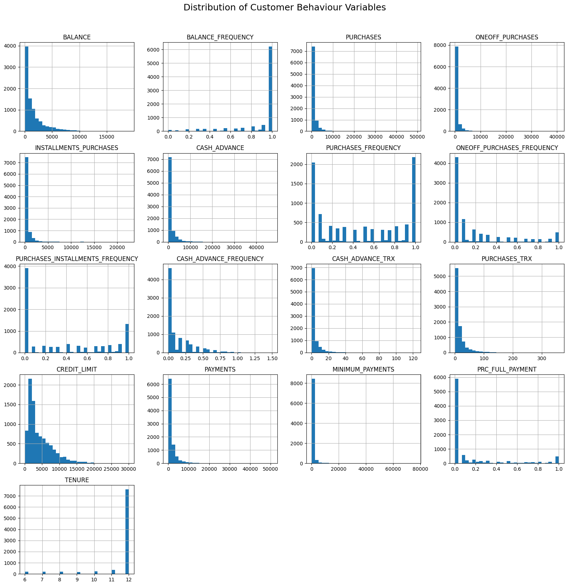
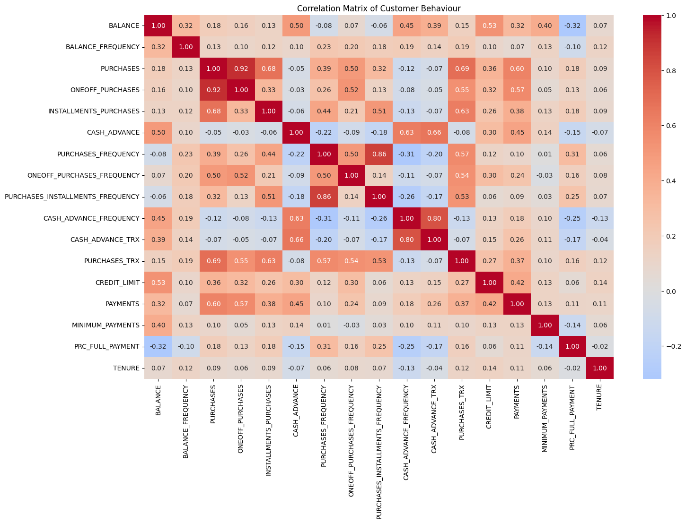
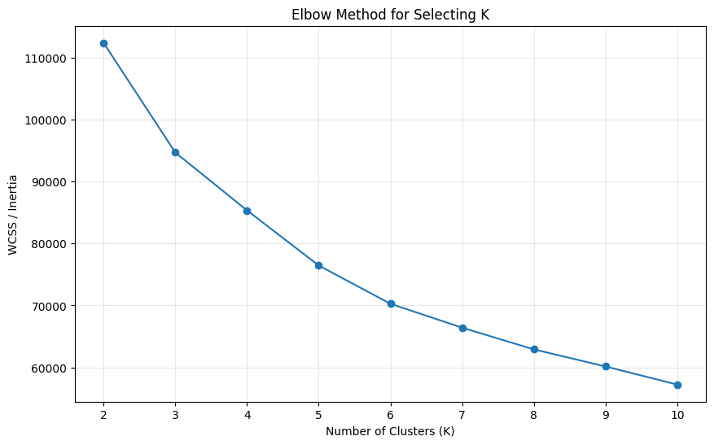
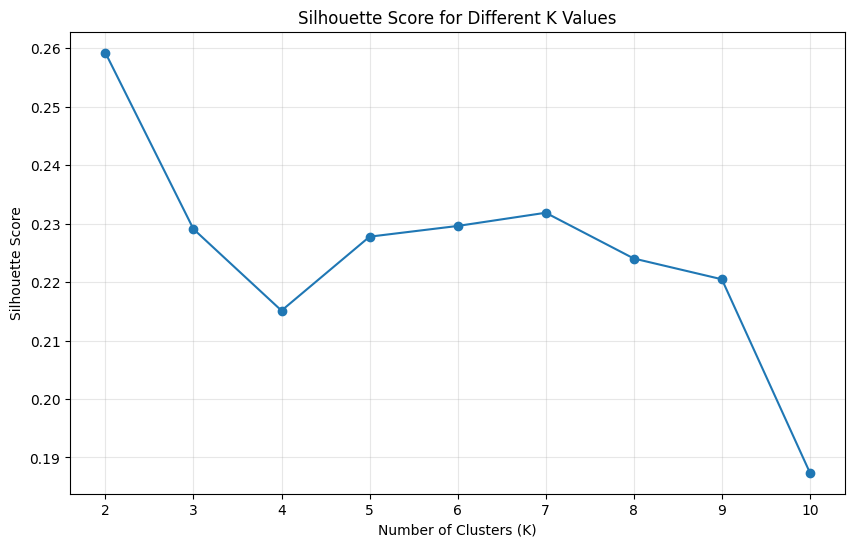

# 🏦 Bank Customer Segmentation

> An end-to-end machine learning project using K-Means clustering to identify meaningful customer segments based on credit-card usage and financial behaviour.

---

## 📌 Project Overview

Banks have customers with very different spending, payment and credit-card usage patterns. Treating every customer in the same way can lead to ineffective marketing and customer engagement strategies.

This project applies **unsupervised machine learning** to identify groups of customers with similar financial behaviours.

### 🎯 Objective

The objective is to:

- Identify distinct customer behaviour patterns
- Segment customers using unsupervised machine learning
- Determine the optimal number of customer segments
- Profile each customer segment
- Generate actionable banking strategies

---

## 🛠️ Technologies Used

- Python
- Pandas
- NumPy
- Matplotlib
- Seaborn
- Scikit-learn
- K-Means Clustering
- StandardScaler
- PCA
- Silhouette Analysis
- Google Colab

---

## 🔄 Project Workflow

```text
Dataset
   ↓
Data Cleaning
   ↓
Exploratory Data Analysis
   ↓
Missing Value Treatment
   ↓
Log Transformation
   ↓
Feature Scaling
   ↓
Elbow Method
   ↓
Silhouette Analysis
   ↓
K-Means Clustering
   ↓
Customer Profiling
   ↓
PCA Visualization
   ↓
Business Recommendations
```

---

## 📊 Dataset

The dataset contains approximately **9,000 credit-card customer records** with **18 behavioural and financial variables**.

### Dataset Features

| Variable Name | Description |
|---|---|
| `CUST_ID` | Identification of the credit card holder |
| `BALANCE` | Balance amount available in the customer's account for making purchases |
| `BALANCE_FREQUENCY` | Frequency with which the customer's balance is updated, ranging from 0 to 1 |
| `PURCHASES` | Total amount of purchases made through the account |
| `ONEOFF_PURCHASES` | Maximum purchase amount made in a single transaction |
| `INSTALLMENTS_PURCHASES` | Total amount of purchases made through installments |
| `CASH_ADVANCE` | Amount of cash advance taken by the customer |
| `PURCHASES_FREQUENCY` | Frequency of purchases made by the customer, ranging from 0 to 1 |
| `ONEOFF_PURCHASES_FREQUENCY` | Frequency of one-off purchases, ranging from 0 to 1 |
| `PURCHASES_INSTALLMENTS_FREQUENCY` | Frequency of installment purchases, ranging from 0 to 1 |
| `CASH_ADVANCE_FREQUENCY` | Frequency of cash-advance transactions |
| `CASH_ADVANCE_TRX` | Number of cash-advance transactions |
| `PURCHASES_TRX` | Number of purchase transactions |
| `CREDIT_LIMIT` | Credit limit assigned to the customer |
| `PAYMENTS` | Total amount of payments made by the customer |
| `MINIMUM_PAYMENTS` | Minimum payment amount made by the customer |
| `PRC_FULL_PAYMENT` | Percentage of payments made in full |
| `TENURE` | Duration of the customer's relationship with the credit-card service |

---

## 🧹 Data Preprocessing

The following preprocessing steps were performed:

### 1. Duplicate Removal

Duplicate customer records were identified and removed to ensure data quality.

### 2. Missing Value Treatment

Missing values in:

- `MINIMUM_PAYMENTS`
- `CREDIT_LIMIT`

were handled using **median imputation**.

### 3. Customer ID Removal

`CUST_ID` was removed because it is an identifier and does not provide meaningful behavioural information for clustering.

### 4. Log Transformation

Financial variables showed significant right-skewness.

A `log1p()` transformation was applied to reduce the influence of extreme values while preserving zero-valued observations.

### 5. Feature Scaling

`StandardScaler` was applied so that features with different numerical ranges would contribute fairly to K-Means distance calculations.

---

## 📈 Exploratory Data Analysis

Exploratory Data Analysis was performed to understand customer behaviour and identify patterns across important financial variables.

The analysis focused on:

- Balance
- Purchases
- Credit Limit
- Cash Advance
- Payments
- Full-Payment Behaviour

### Feature Distributions



### Correlation Matrix



---

## 📐 Selecting the Number of Clusters

Two approaches were used to determine the appropriate number of clusters.

### 1. Elbow Method

The Elbow Method was used to examine the **Within-Cluster Sum of Squares (WCSS)** for different values of K.



### 2. Silhouette Analysis

Silhouette Scores were calculated for K values ranging from **2 to 10**.

The highest score obtained was:

### ⭐ K = 3

### ⭐ Silhouette Score = 0.2510



Based on the evaluation, **3 clusters** were selected for the final K-Means model.

---

## 🤖 K-Means Clustering

The final model was trained using:

| Parameter | Value |
|---|---|
| **Algorithm** | K-Means |
| **Number of Clusters** | 3 |
| **Random State** | 42 |
| **Number of Initializations** | 10 |

---

## 👥 Customer Segments

The final clustering analysis identified three major customer groups.

### 🟢 Cluster 0 — High-Value Active Customers

**Characteristics:**

- High purchase activity
- High payment activity
- Relatively high credit limit
- Relatively low cash-advance usage
- Higher full-payment behaviour

**Business Strategy:**

- Premium credit cards
- Exclusive rewards
- Cashback programs
- Personalized offers
- Loyalty programs
- Cross-selling relevant financial products

---

### 🔵 Cluster 1 — Low-Engagement Customers

**Characteristics:**

- Lower purchase activity
- Lower payment activity
- Lower balance
- Lower credit limit compared with other segments

**Business Strategy:**

- Cashback campaigns
- Personalized promotions
- Loyalty incentives
- Card-usage campaigns
- Customer engagement programs

---

### 🔴 Cluster 2 — Cash-Advance Heavy Customers

**Characteristics:**

- High balance
- Very high cash-advance usage
- Relatively low purchase activity
- Very low full-payment ratio

**Business Strategy:**

- Monitor cash-advance behaviour
- Encourage healthier repayment behaviour
- Offer appropriate financial-management products
- Provide personalized financial guidance
- Evaluate for additional credit-risk monitoring

> **Note:** The clustering model identifies behavioural patterns. It does not prove that customers are in default or are definitively high-risk.

---

## 📊 Customer Segment Distribution

The following visualization shows the distribution of customers across the three identified segments.


---

## 📋 Cluster Profile

The average behaviour of each cluster was analysed using:

- Balance
- Purchases
- Credit Limit
- Cash Advance
- Payments
- Percentage of Full Payment

| Cluster | Balance | Purchases | Credit Limit | Cash Advance | Payments | Full Payment |
|---|---:|---:|---:|---:|---:|---:|
| **0** | 2,182.35 | 4,187.02 | 7,642.78 | 449.75 | 4,075.53 | 30% |
| **1** | 807.72 | 496.06 | 3,267.02 | 339.00 | 907.45 | 15% |
| **2** | 4,023.79 | 389.05 | 6,729.47 | 3,917.25 | 3,053.94 | 3% |


---

## 🧠 PCA Visualization

Principal Component Analysis (**PCA**) was used to reduce the dimensionality of the dataset to two dimensions for visualization.


---

## 💡 Business Insights

### 🟢 High-Value Active Customers

Customers with strong purchase and payment activity can be targeted with premium services, exclusive rewards and loyalty programs.

### 🔵 Low-Engagement Customers

Customers with lower activity can be targeted with personalized campaigns designed to increase card usage and customer engagement.

### 🔴 Cash-Advance Heavy Customers

Customers showing high cash-advance usage and low full-payment behaviour may benefit from closer behavioural monitoring and appropriate financial products.

---

## 🎯 Business Applications

The segmentation framework can support:

- Customer profiling
- Personalized marketing
- Customer retention
- Loyalty programs
- Premium customer identification
- Cross-selling
- Upselling
- Campaign optimization
- Customer engagement
- Behaviour monitoring

---

## 📁 Repository Structure

```text
bank-customer-segmentation/
│
├── bank_customer_segmentation.ipynb
├── README.md
│
└── images/
    ├── feature_distributions.png
    ├── correlation_matrix.png
    ├── elbow_method.png
    ├── silhouette_scores.png
    ├── cluster_distribution.png
    ├── cluster_profile.png
    └── pca_clusters.png
```

---

## 🚀 How to Run

### 1. Clone the repository

```bash
git clone https://github.com/saba0-data/bank-customer-segmentation.git
```

### 2. Open the notebook

Open:

```text
bank_customer_segmentation.ipynb
```

using **Google Colab** or **Jupyter Notebook**.

### 3. Upload the dataset

Upload the required credit-card customer dataset when prompted.

### 4. Install dependencies

```bash
pip install pandas numpy matplotlib seaborn scikit-learn
```

### 5. Run all cells

Execute the notebook from beginning to end.

---

## 📌 Key Results

| Metric | Result |
|---|---|
| **Customer Records** | ~8,950 |
| **Final Clusters** | **3** |
| **Best Silhouette Score** | **0.2510** |
| **Algorithm** | **K-Means** |
| **Visualization** | **PCA** |

---

## 📚 Key Learnings

Through this project, I strengthened my understanding of:

- Unsupervised Machine Learning
- K-Means Clustering
- Feature Preprocessing
- Log Transformation
- Feature Scaling
- Cluster Evaluation
- Silhouette Analysis
- PCA
- Customer Profiling
- Business-oriented Data Analysis
- Translating Machine Learning Results into Business Insights

---

## 👩‍💻 Author

### Saba Sultana

**M.Sc. Data Science**

Interested in:

- Data Analytics
- Business Intelligence
- Machine Learning
- Banking Analytics
- Data-Driven Decision Making

---

⭐ If you found this project useful, feel free to explore the repository.
